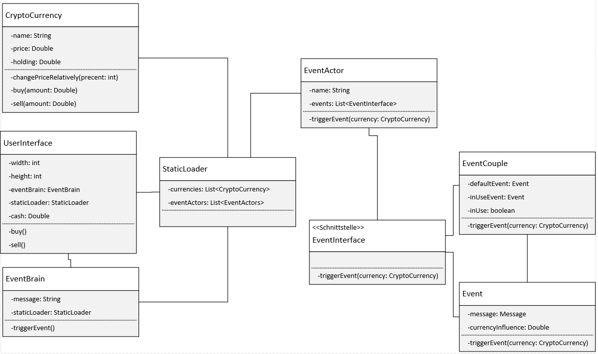

# Project Dokumentation
## Crypto Game:

Wir haben ein kleines spiel erstellt, indem man sich von vier Coins eine aussuchen kann und in diese investieren.
Man kann also jede Runde eine Menge Geld wählen, die man gerne investieren möchte
und dann wird per zufall ein Event ausgelöst welches den Kurs entweder steigen oder fallen lässt.
Es gibt immer einen sogenannten EventActor also zum Beispiel Elon Musk, der dann ein Event ausführt.
Er tweeted vielleicht über eine der Coins und dann kann das einen entweder positiven oder negativen effekt haben.
Der Effekt ist in eine vorbestimmten range also gibt es Events, die sowohl negativ als auch positiv ausfallen können,
wenn man nur genug glück hat. 
**Das Ziel ist es dann möglichst viel Geld in kurzer Zeit zu machen,
wie es halt so üblich ist in einem kapitalistischen System.**

##Klassen Diagramm:

Der Aufbau sieht zwar auf den ersten Blick relativ kompliziert aus aber das ist er eigentlich nicht.
Wir haben die CryptoCurrency also die Währung mit dem Namen dem Kurs und der anzahl die man besitzt.
Und dan drei Funktionen, zwei für das kaufen und verkaufen und eine um den Kurs zu ändern.
Im UserInterface werden die grössen des GUI's angegeben und die menge an Geld die der Spieler hat.
Das EventBrain ist verantwortlich für die auslösung eines neuen events.
Der Static Loader is sozusagen die Main Klasse welche statisch alle Daten die wir das Spiel brauchen.
Also die Währung die genauen Events usw. sind dort definiert.
Der EventActor ist dann die Person/Organisation welche "verantwortlich" ist für das Event.
Das EventInterface dient als eine Art Klasse, die wir in den anderen Klassen implementieren,
um die TriggerEvent funktion mehrmals brauchen zu können.
Im Event ist dann die genau Nachricht definiert und die Influenz der Coin.
Und die EventCouple Klass als Letztes verbindet das Event mit der bestimmten Coin.

## Selbstreflexion

Wir haben mit einem Kurzen Brainstorming begonnen und einige Ideen gesammelt.
Entschieden haben wir uns dann für das Crypto Game, weil es spassig klang es umzusetzen.
Da wir nicht das erste Mal zusammen an einem Projekt arbeiteten,
lief unsere Absprache sehr gut.
Wir sind dann ungefähr dem Plan gefolgt der im Projektarbeit.pdf definiert ist.
Auch wenn wir am Anfang nur sporadisch vorankamen vor allem mit den Diagrammen und Dokumentation,
welche uns beiden nicht sehr gefallen.
Schlussendlich kamen wir dann aber sehr gut voran, auch wenn uns das Kreieren des GUI's ein paar Probleme bereitet hat.
Das ganze ging dan aber wesentlich besser als wir die Funktion unserer IDE gefunden haben,
welche uns eine visuelle oberfläche gibt, um das Interface zu erstellen.
Dann ging es eigentlich nur noch darum einige Bugs in unserem Programm zu fixen und den letzten feinschliff zu machen.
Wir sind beide zufrieden mit dem Ergebnisse unserer Arbeit, auch wenn es vermutlich noch einig Funktionen gibt,
die wir beide noch gerne umsetzten, würden aber dafür fehlt uns leider die Zeit
und es sie würden vermutlich den Rahmen dieser Projektarbeit sprengen.

